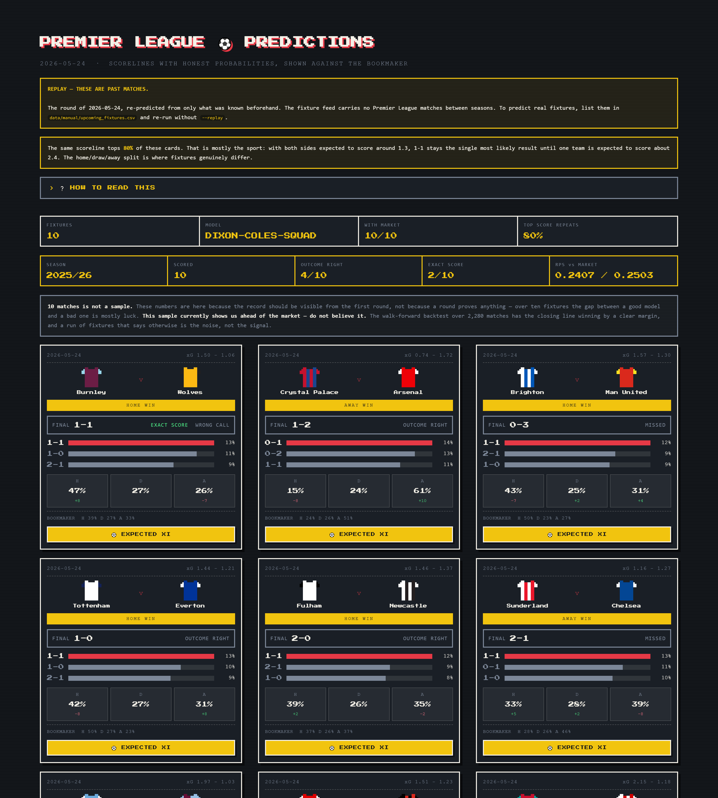
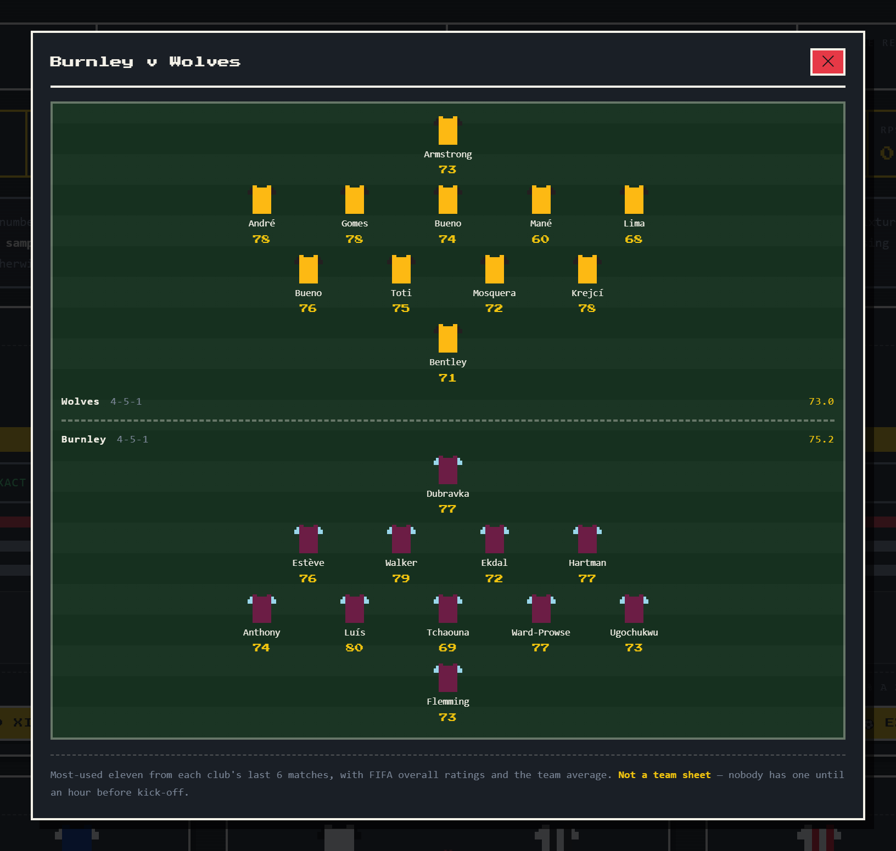

# Premier League Match Prediction

### [→ See this week's predictions](https://mk-premier-league-match-prediction.streamlit.app/)

[](https://github.com/maciekwolus/premier-league-match-prediction/actions/workflows/ci.yml)
[](https://github.com/maciekwolus/premier-league-match-prediction/actions/workflows/predict-round.yml)

Predicts the **scoreline** of upcoming Premier League fixtures, with probabilities — and
shows every prediction next to the bookmaker's line, so it is obvious whether the model is
actually adding anything.

**The site updates itself.** A scheduled job predicts each round a few days before it kicks
off, commits it, and the page redeploys — so what you are looking at was written *before*
those matches were played, and is never rewritten afterwards.

```
Crystal Palace vs Arsenal     0-1 (14%) · 0-2 (13%) · 1-1 (11%)
                              Home 15% | Draw 24% | Away 61%
                              Bookmaker: 24% | 26% | 51%
```

## Why this exists

**It is a workout for Claude Code, disguised as a football project.** The predictions are
real, but the point was to see how an AI coding agent copes with a project long enough to
outlive its own memory.

- **A written plan.** [PLAN.md](PLAN.md) holds the scope; every session starts by reading it.
- **Instructions that outlive the conversation.** [CLAUDE.md](CLAUDE.md) carries the rules
  and the traps.
- **Parallel subagents**, one per season, on work that was genuinely parallel.
- **A branch and a PR per phase.** Nothing reached `main` unread.
- **Skills** for the workflows that recur — see [SKILLS.md](SKILLS.md).
- **UI checked by measuring the page**, never by reading the code.

The most useful lesson had nothing to do with football: **a feature with passing tests can
be connected to nothing at all.** A whole squad-adjustment mechanism was built, tested and
documented before anyone noticed that nothing called it.

## What it does

Seven seasons of results are joined to the **players who actually started each match**, and
those players are matched to their FIFA ratings — so the model knows not just that Arsenal
are playing, but which Arsenal turned up. Rolling form, expected goals, Elo and rest days
go in alongside. A set of goals models turns that into two expected-goals numbers per
fixture, which become a full scoreline probability matrix.

| Input | Source |
|---|---|
| Results, shots, cards, odds | [football-data.co.uk](https://www.football-data.co.uk/englandm.php) |
| Lineups and expected goals | [Understat](https://understat.com) |
| Player ratings | FIFA 20–23 / EA Sports FC 24–26 |

**Trained on 2019/20 through 2025/26 — 2,660 matches, 99 features, 9 models benchmarked.**
It predicts **2026/27**, a season with no results yet: the twenty clubs and all 380
fixtures come from the Fantasy Premier League API, and clubs promoted into the division
get an eleven built from ratings, since there is no history here to read one from.

Squads are kept honest against reality rather than against last season. Expected XIs come
from who a club has actually been starting, then anyone the **Fantasy Premier League squad
lists** no longer show at that club is dropped — Casemiro played all of 2025/26 for Man
United and was still being picked a year after leaving. Suspensions come out of cards
already on disk. Signings are reported but never selected, because a player with no
appearances cannot be ranked against the players who have them.

Every prediction is **archived the moment it is made and never rewritten**, because the
only interesting question about a forecast is what it said *before* the match — and that
cannot be reconstructed afterwards.

## The report



Styled after a teletext results page. Each card gives the most likely scorelines, the
home/draw/away split, and where the model **disagrees with the market by more than ten
points** — the only genuinely interesting thing a model can offer once a market exists.
Club crests are trademarked, so each side gets a pixel kit instead, generated as inline SVG.

Once more than one round is stored a **season and round picker** appears, and any round that has
been played shows the final score on each card with a verdict — including `EXACT SCORE`
alongside `WRONG CALL` when the scoreline landed but the headline call did not, which is
the normal case rather than an edge one.

Played rounds also carry a season-to-date scorecard putting our RPS next to the
bookmaker's **over the same fixtures**. Under thirty scored matches it says plainly that
this is not a sample — and if that small sample happens to beat the market, it says not to
believe it and points at the 2,280-match backtest instead. (The screenshot above is the
opening round of 2026/27, which nobody has played yet, so it carries neither.)

Every card opens an **expected XI** — both sides on a pitch, attackers meeting at the
halfway line, with each player's FIFA rating and the team average. This is where the
squad-quality signal stops being a number in a table:



## Does it beat the bookmaker?

**No — and that is the correct result.** Ranked Probability Score, walk-forward over 2,280
matches, lower is better:

| | RPS |
|---|---|
| **bookmaker (closing odds)** | **0.1965** |
| gbm-with-odds | 0.2027 |
| poisson-glm | 0.2039 |
| baseline-elo | 0.2051 |
| dixon-coles-squad *(what the report shows)* | 0.2087 |
| baseline-league-average | 0.2346 |

*A selection; [CLAUDE.md](CLAUDE.md) carries all ten.*

A model that beat the closing line should be suspected of data leakage before it is
believed. Two things worth noticing: **plain Elo beats AutoGluon on 85 features**, and the
report deliberately does *not* use the best-scoring model — `poisson-glm` wins on RPS by
hedging, which makes it call 1-1 in 74% of matches. When the deliverable is a scoreline,
that is a failure whatever the score says.

## Running it

It is already running at
**[mk-premier-league-match-prediction.streamlit.app](https://mk-premier-league-match-prediction.streamlit.app/)** —
nothing to install if you only want to look at it.

To run it yourself: **[SETUP.md](SETUP.md) — how to install and run the whole app**, from a
fresh clone to the report on screen.

Already built? Then it is two lines, and the `cd` is the one people skip:

```bash
cd C:\repositories\premier-league-match-prediction
```
```bash
.venv\Scripts\python.exe -m streamlit run app.py
```

## Also here

| File | What it is |
|---|---|
| [SETUP.md](SETUP.md) | Install and run the whole app, step by step |
| [COMMANDS.md](COMMANDS.md) | Every command and flag, plus what the error messages mean |
| [PLAN.md](PLAN.md) | The build plan, both stages, and where each phase landed |
| [CLAUDE.md](CLAUDE.md) | Architecture contracts, leakage rules, and the data quirks worth knowing |
| [SKILLS.md](SKILLS.md) | The four Claude Code skills in this repo, and when to reach for each |

```
src/config.py     seasons, paths, source URLs — the single place seasons are defined
src/data/         acquisition and cleaning, one module per source
src/matching/     name reconciliation between sources
src/features/     squad quality, form, Elo, and the feature table
src/models/       goals models and the scoreline matrix
src/evaluate/     scoring, walk-forward backtesting, the bookmaker benchmark
src/predict/      fixtures, expected XIs, squad currency, and the prediction archive
src/report/       shaping predictions for display
app.py            the Streamlit report
tests/            441 tests, no network access and no reading of data/
data/manual/      hand-written overrides: names, ratings, absences, fixtures (committed)
```

**Status: complete.** Stage one built the pipeline; stage two made it survive a live
season — archived predictions, a scored history, suspensions, and squads for clubs the
data has never seen. Almost no data is committed: it is gitignored and rebuilt from source.

## Built with

**Python 3.12.** [requirements.txt](requirements.txt) is small, quick and free of hard
version pins — which is what makes it safe to deploy. The two awkward dependencies are
separate, in [requirements-full.txt](requirements-full.txt), and all 441 tests pass with
both absent. This is what each one is here for.

| | | |
|---|---|---|
| **Data** | `pandas`, `numpy` | Every stage is a dataframe; parquet on disk between them |
| | `pyarrow` | The parquet reader and writer |
| **Sources** | `requests` | football-data CSVs, the Fantasy Premier League API |
| | `understatapi` | Per-match lineups and expected goals *(separate: it hard-pins urllib3)* |
| **Matching** | `rapidfuzz` | Player names across three sources that spell them differently |
| **Models** | `scipy` | Optimises Dixon-Coles — the model the report actually uses |
| | `autogluon.tabular` | Gradient boosting *(separate: ~700 MB)*. `compare --fast` runs without it |
| **Report** | `streamlit` | The page. Cards are hand-written HTML; Streamlit does layout |
| **Tooling** | `pytest`, `ruff` | 441 tests, lint and format — run on every push by [GitHub Actions](.github/workflows/ci.yml) |

**No neural network was written by hand** — that was a constraint from the start.
Dixon-Coles is a well-defined statistical model fitted with `scipy.optimize`, and AutoGluon
handles the machine learning behind a `.fit()`.

**Not used, deliberately.** No database: parquet files are faster at this size and diff
cleanly. No web framework: the report is a single Streamlit script. **Every data source is
free**, and the one that needs an account — Kaggle, for the player ratings — is placed by
hand rather than automated around, because credentials are the user's to handle.
